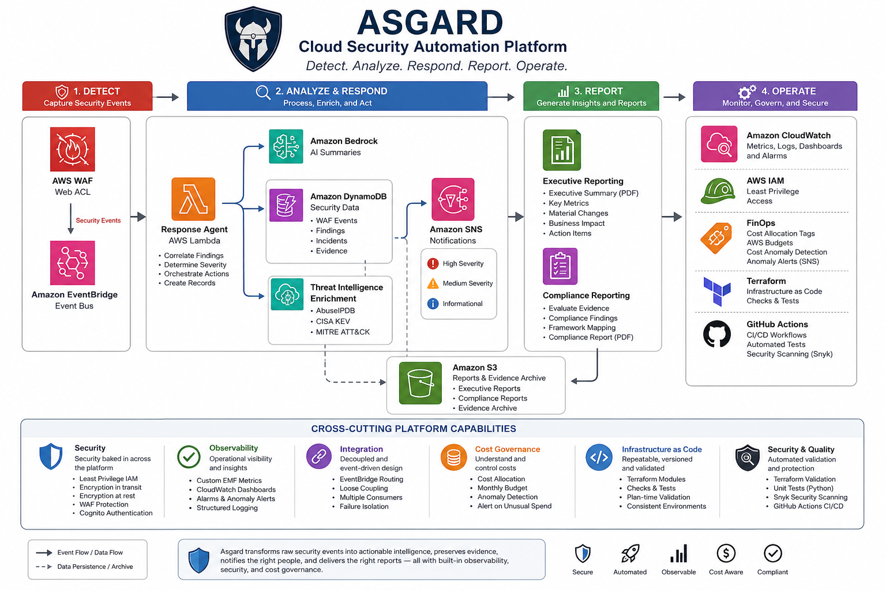

# ASGARD

## Automated Security Governance, Analysis, Response & Detection

ASGARD is an event-driven cloud security automation platform built on AWS and provisioned with Terraform.

The platform demonstrates how managed AWS services can work together to detect security events, analyze and enrich findings, automate response workflows, preserve security evidence, notify responders, generate leadership and compliance reports, and monitor the operational cost and health of the environment.

Rather than treating detection, response, reporting, observability, security governance, and cost management as separate concerns, ASGARD integrates them into a single cloud-native platform.

---

## Architecture



ASGARD follows four primary stages:

**Detect → Analyze & Respond → Report → Operate**

This separation keeps individual components loosely coupled while allowing security events and evidence to move through a consistent workflow.

---

## Platform Capabilities

- Event-driven security detection and response
- Threat intelligence enrichment
- Security evidence collection and archival
- AI-assisted security summaries using Amazon Bedrock
- Severity-based incident notification
- Executive and compliance reporting
- CloudWatch observability and operational metrics
- FinOps cost allocation, budgeting, and anomaly monitoring
- Infrastructure validation with Terraform
- Automated CI testing and security scanning

---

# How ASGARD Works

## 1. Detect

AWS WAF provides the initial web-security detection layer.

Security events enter an event-driven workflow through Amazon EventBridge rather than requiring downstream components to continuously poll for new findings.

EventBridge provides routing between event producers and consumers, allowing processing and notification components to remain decoupled.

---

## 2. Analyze & Respond

### Security Response Agent

AWS Lambda provides the primary event-processing layer.

The response workflow:

- Processes incoming security events
- Correlates security findings
- Determines severity
- Creates structured security records
- Coordinates downstream actions
- Triggers notifications when human attention is required

### Threat Intelligence Enrichment

Security findings can be enriched with additional context from external threat-intelligence sources, including:

- AbuseIPDB
- CISA Known Exploited Vulnerabilities
- MITRE ATT&CK

Threat enrichment is implemented as a **best-effort capability**.

Failure of an individual enrichment provider does not prevent the core security workflow from continuing. External intelligence can improve a finding without becoming a single point of failure for the platform.

### Amazon Bedrock

Amazon Bedrock provides AI-assisted generation of human-readable security summaries from structured findings.

AI-generated content supplements the underlying security evidence rather than replacing it. Original findings and supporting evidence remain available for investigation and reporting.

---

## 3. Preserve Security Data

Amazon DynamoDB stores security information across purpose-specific data domains, including:

- WAF events
- Correlation findings
- Security incidents
- Compliance evidence
- Compliance findings

Separating these domains allows individual parts of the platform to operate against the information relevant to their responsibility.

Security evidence and generated reporting artifacts can also be preserved in Amazon S3 for longer-term retention and downstream analysis.

---

## 4. Notify

Amazon SNS provides severity-based notification capabilities for security findings requiring human attention.

EventBridge allows multiple consumers to respond to security events without requiring the originating service to understand each downstream workflow.

This event-driven approach reduces direct dependencies between components and makes additional consumers easier to introduce.

---

# Reporting

## Executive Reporting

ASGARD includes an Executive Dashboard Agent that transforms security information into leadership-facing PDF and JSON reports.

Executive reporting summarizes areas such as:

- Overall security posture
- Key security metrics
- Material changes
- Business impact
- Items requiring leadership attention

Generated reports are stored in Amazon S3.

> Executive report example coming soon.

## Compliance Reporting

A separate compliance workflow evaluates security evidence and generates structured compliance findings and reports.

The separation between evidence and findings allows the platform to preserve what was observed independently from the conclusions generated from that evidence.

Compliance reporting artifacts are also stored in Amazon S3.

> Compliance report example coming soon.

---

# Observability

ASGARD includes Amazon CloudWatch observability for monitoring the operation of the security workflow.

Application metrics provide visibility into processing behavior beyond standard Lambda logs.

CloudWatch capabilities include:

- Logs
- Custom metrics
- Dashboards
- Operational visibility
- Alerting

This provides a centralized view into platform activity and health.

Additional implementation details are documented in [`MONITORING.md`](MONITORING.md).

---

# FinOps & Cost Governance

Cost governance is treated as part of operating the platform rather than an afterthought.

ASGARD includes multiple FinOps controls.

### Cost Allocation

A consistent `Project` tag identifies resources belonging to ASGARD and provides a foundation for cost attribution.

### AWS Budgets

AWS Budgets establishes a defined monthly spending threshold for the environment.

### Cost Anomaly Detection

AWS Cost Anomaly Detection monitors service-level spending behavior for unexpected changes.

An anomaly subscription provides notification when detected cost impact meets or exceeds the configured threshold.

Together, these controls answer two different operational questions:

> **Budget:** What did we plan to spend?

> **Cost Anomaly Detection:** Is our spending behaving unexpectedly?

Additional implementation details are documented in [`FINOPS.md`](FINOPS.md).

---

# Security Design

Security controls are incorporated throughout ASGARD rather than implemented as a single security layer.

Design considerations include:

- Least-privilege IAM permissions
- AWS WAF protection
- Cognito-backed API authentication
- Event-driven service isolation
- Server-side encryption for persisted data
- Purpose-specific DynamoDB tables
- Controlled S3 report storage
- Security evidence preservation
- Automated infrastructure validation
- Dependency and security scanning

---

# Resilience & Failure Isolation

ASGARD favors decoupled components and graceful degradation where possible.

Threat-intelligence enrichment provides one example.

External intelligence improves the context surrounding a finding, but failure of an individual provider does not prevent the primary security event from continuing through the processing pipeline.

Amazon EventBridge also reduces direct dependencies between event producers and consumers, allowing notification, processing, and other workflows to evolve independently.

---

# Infrastructure as Code

The AWS environment is provisioned using Terraform.

Infrastructure definitions include:

- AWS WAF
- Amazon EventBridge
- AWS Lambda
- Amazon DynamoDB
- Amazon SNS
- Amazon API Gateway
- Amazon Cognito
- Amazon Bedrock integration
- Amazon S3
- Amazon CloudWatch
- AWS IAM
- AWS Budgets
- AWS Cost Anomaly Detection

Terraform is also used to encode infrastructure expectations rather than relying exclusively on manual inspection.

---

# Infrastructure Validation

ASGARD uses multiple layers of Terraform validation.

## Terraform Check Blocks

Terraform `check` blocks validate architectural and configuration expectations across resources including:

- IAM
- Lambda
- DynamoDB
- EventBridge
- SNS
- API Gateway
- Cognito
- S3
- WAF
- FinOps controls

These checks keep readable infrastructure assertions close to the resources they validate.

## Terraform Tests

Focused `.tftest.hcl` tests provide plan-time validation for selected high-value infrastructure behavior.

The test suite intentionally does **not** duplicate every root-level check.

Instead, Terraform tests focus on configuration where regression protection provides meaningful value during CI.

---

# CI/CD & Automated Quality Gates

GitHub Actions provides automated validation for infrastructure and application changes.

## Terraform Pre-Flight Validation

Terraform changes are evaluated through:

- `terraform fmt`
- `terraform init`
- `terraform validate`
- Focused Terraform tests

Plan-time Terraform tests are isolated from root-level checks that depend on AWS-generated values only available after deployment.

## Python Testing

Focused Python tests validate security-processing behavior without requiring live AWS services.

AWS clients can be mocked where appropriate so application logic can be tested independently from deployed infrastructure.

## Security Scanning

Snyk is integrated with GitHub Actions to provide automated security analysis.

Together, the CI workflows provide quality gates across:

```text
Infrastructure syntax
        +
Infrastructure behavior
        +
Application behavior
        +
Security analysis
```

---

# Engineering Challenges & Lessons Learned

## Cross-Platform Lambda Packaging

During development on macOS, the Executive Dashboard Lambda initially failed in AWS with:

```text
Runtime.ImportModuleError
cannot import name '_imaging' from PIL
```

The packaged Pillow dependency contained native macOS binaries that were incompatible with the Linux AWS Lambda runtime.

The dependencies were rebuilt using the official AWS Lambda Python Docker environment, producing Linux-compatible binaries before deployment.

This reinforced an important deployment principle:

> Native dependencies must be packaged for the operating system and architecture of the target runtime, not the developer workstation.

## Plan-Time vs. Apply-Time Terraform Validation

The Terraform CI pipeline exposed an important distinction between values known during `terraform plan` and AWS-generated values available only after resources are created.

Root-level checks that depended on computed AWS attributes interfered with focused plan-time Terraform tests.

The CI workflow was adjusted to isolate those infrastructure checks while `.tftest.hcl` tests execute.

This preserved both validation approaches without removing useful infrastructure safeguards.

---

# Technology Stack

| Area | Technology |
|---|---|
| Cloud Platform | AWS |
| Infrastructure as Code | Terraform |
| Compute | AWS Lambda |
| Event Routing | Amazon EventBridge |
| Web Security | AWS WAF |
| Identity | Amazon Cognito, AWS IAM |
| Data | Amazon DynamoDB |
| Object Storage | Amazon S3 |
| Generative AI | Amazon Bedrock |
| Notifications | Amazon SNS |
| API | Amazon API Gateway |
| Observability | Amazon CloudWatch |
| FinOps | AWS Budgets, Cost Allocation, Cost Anomaly Detection |
| CI/CD | GitHub Actions |
| Security Scanning | Snyk |
| Application Development | Python |

---

# What ASGARD Demonstrates

ASGARD demonstrates more than provisioning individual AWS resources.

The project explores how cloud services can be integrated into an operational platform with consideration for:

- Event-driven architecture
- Cloud security
- Infrastructure as Code
- Automated testing
- CI/CD
- Observability
- Failure isolation
- AI-assisted workflows
- Security evidence management
- Cost governance
- Operational troubleshooting

The project follows an iterative engineering approach:

**Build → Validate → Observe → Improve → Automate**

---

# Additional Documentation

More detailed implementation documentation is available in:

- [`FINOPS.md`](FINOPS.md) — cost allocation, budgets, anomaly detection, and FinOps considerations
- [`MONITORING.md`](MONITORING.md) — CloudWatch monitoring and operational metrics
- [`THREAT_ENRICHMENT.md`](THREAT_ENRICHMENT.md) — threat-intelligence enrichment architecture and provider behavior

---

# Author

**Kevin Willocks**

AWS Certified Solutions Architect – Associate  
HashiCorp Certified: Terraform Associate
